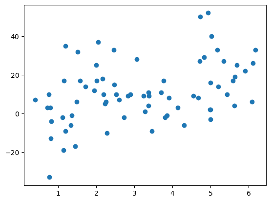

# Imports and Loading Data


```python
import pandas as pd
import numpy as np
import matplotlib.pyplot as plt
import seaborn as sns
from sklearn.base import clone
from sklearn.metrics import r2_score
import sklearn
from statsmodels.formula.api import ols as sm_ols
from statsmodels.iolib.summary2 import summary_col
from df_after_transform import df_after_transform
from sklearn import set_config
from sklearn.calibration import CalibrationDisplay
from sklearn.compose import (
    ColumnTransformer,
    make_column_selector,
    make_column_transformer,
)
from sklearn.decomposition import PCA
from sklearn.ensemble import HistGradientBoostingClassifier,HistGradientBoostingRegressor
from sklearn.feature_selection import (
    RFECV,
    SelectFromModel,
    SelectKBest,
    SequentialFeatureSelector,
    f_classif,
)
from sklearn.impute import SimpleImputer
from sklearn.linear_model import (Lasso, 
                                 LassoCV, 
                                 LogisticRegression,
                                 Ridge,
                                 LinearRegression
)

from sklearn.metrics import (
    ConfusionMatrixDisplay,
    DetCurveDisplay,
    PrecisionRecallDisplay,
    RocCurveDisplay,
    classification_report,
    make_scorer,
)
from sklearn.model_selection import (
    GridSearchCV,
    KFold,
    cross_validate,
    train_test_split,
    TimeSeriesSplit,
    ParameterGrid
)
from sklearn.pipeline import Pipeline, make_pipeline
from sklearn.preprocessing import (
    OneHotEncoder,
    OrdinalEncoder,
    PolynomialFeatures,
    StandardScaler,
)
from sklearn.neighbors import KNeighborsRegressor
from sklearn.svm import LinearSVC

set_config(display="diagram")  # display='text' is the default

pd.set_option(
    "display.max_colwidth", 1000, "display.max_rows", 59, "display.max_columns", None
)

import warnings

warnings.filterwarnings("ignore")
```


```python
celtics = pd.read_excel('nba.xlsx')
celtics = celtics.set_axis(celtics.iloc[0], axis=1).drop(index=0)

not_numbers = ['Date','Opponent','Home_Away','In Season Tournament','Win','Opp_Win_Last_Game']
bool_columns = ['In_Season_Tournament','Opp_Win_Last_Game','Win']

for col in celtics.columns:
    if col not in not_numbers:
        celtics[col] = pd.to_numeric(celtics[col])
    if col in bool_columns:
        celtics[col] = celtics[col].astype(bool)
    
celtics.head(5)
```


<div>
<style scoped>
    .dataframe tbody tr th:only-of-type {
        vertical-align: middle;
    }

    .dataframe tbody tr th {
        vertical-align: top;
    }

    .dataframe thead th {
        text-align: right;
    }
</style>
<table border="1" class="dataframe">
  <thead>
    <tr style="text-align: right;">
      <th></th>
      <th>Date</th>
      <th>Opponent</th>
      <th>Home_Away</th>
      <th>In_Season_Tournament</th>
      <th>Celtics_Win_Pct</th>
      <th>Celtics_Home_Win_Pct</th>
      <th>Celtics_Away_Win_Pct</th>
      <th>Celtics_Win_Pct_Last_5_Games</th>
      <th>Celtics_Win_Pct_Last_10_Games</th>
      <th>Celtics_Avg_Points_Per_Game</th>
      <th>Celtics_Avg_Points_Last_5_Games</th>
      <th>Celtics_Avg_Points_Last_10_Games</th>
      <th>Celtics_Avg_Off_Rating</th>
      <th>Celtics_Avg_Off_Rating_Last_10_Games</th>
      <th>Celtics_Avg_Def_Rating</th>
      <th>Celtics_Avg_Def_Rating_Last_10_Games</th>
      <th>Celtics_Avg_FG_Last_10_Games</th>
      <th>Celtics_Avg_FG_Pct_Last_10_Games</th>
      <th>Celtics_Avg_3P_Last_10_Games</th>
      <th>Celtics_Avg_3P_Pct_Last_10_Games</th>
      <th>Celtics_Avg_FT_Last_10_Games</th>
      <th>Celtics_Avg_FT_Pct_Last_10_Games</th>
      <th>Celtics_Rank_In_Conference</th>
      <th>Celtics_Rank_In_Division</th>
      <th>Celtics_Strength_Of_Key_Players_Missing</th>
      <th>Opp_Win_Pct</th>
      <th>Opp_Points_Last_Game</th>
      <th>Opp_Win_Last_Game</th>
      <th>Opp_FG_Last_Game</th>
      <th>Opp_FG_Pct_Last_Game</th>
      <th>Opp_3P_Last_Game</th>
      <th>Opp_3P_Pct_Last_Game</th>
      <th>Opp_FT_Last_Game</th>
      <th>Opp_FT_Pct_Last_Game</th>
      <th>Opp_Off_Rating_Last_Game</th>
      <th>Opp_Def_Rating_Last_Game</th>
      <th>Opp_Rank_In_Conference</th>
      <th>Opp_Rank_In_Division</th>
      <th>Opp_Strength_Of_Key_Players_Missing</th>
      <th>Win</th>
      <th>Celtics_Points</th>
      <th>Opp_Points</th>
      <th>Diff_Points</th>
      <th>Total_Points</th>
      <th>Over_Under</th>
      <th>Celtics_Spread_Diff</th>
      <th>Celtics_Spread_Payout</th>
      <th>Opp_Spread_Diff</th>
      <th>Opp_Spread_Payout</th>
    </tr>
  </thead>
  <tbody>
    <tr>
      <th>1</th>
      <td>2023-10-25 00:00:00</td>
      <td>New York Knicks</td>
      <td>Away</td>
      <td>False</td>
      <td>NaN</td>
      <td>NaN</td>
      <td>NaN</td>
      <td>NaN</td>
      <td>NaN</td>
      <td>NaN</td>
      <td>NaN</td>
      <td>NaN</td>
      <td>NaN</td>
      <td>NaN</td>
      <td>NaN</td>
      <td>NaN</td>
      <td>NaN</td>
      <td>NaN</td>
      <td>NaN</td>
      <td>NaN</td>
      <td>NaN</td>
      <td>NaN</td>
      <td>NaN</td>
      <td>NaN</td>
      <td>0</td>
      <td>NaN</td>
      <td>NaN</td>
      <td>True</td>
      <td>NaN</td>
      <td>NaN</td>
      <td>NaN</td>
      <td>NaN</td>
      <td>NaN</td>
      <td>NaN</td>
      <td>NaN</td>
      <td>NaN</td>
      <td>NaN</td>
      <td>NaN</td>
      <td>0</td>
      <td>True</td>
      <td>108</td>
      <td>104</td>
      <td>4</td>
      <td>212</td>
      <td>223.0</td>
      <td>-3.5</td>
      <td>-112</td>
      <td>3.5</td>
      <td>-108</td>
    </tr>
    <tr>
      <th>2</th>
      <td>2023-10-27 00:00:00</td>
      <td>Miami Heat</td>
      <td>Home</td>
      <td>False</td>
      <td>1.0</td>
      <td>NaN</td>
      <td>1.0</td>
      <td>NaN</td>
      <td>NaN</td>
      <td>108.000000</td>
      <td>NaN</td>
      <td>NaN</td>
      <td>114.400000</td>
      <td>NaN</td>
      <td>110.100000</td>
      <td>NaN</td>
      <td>NaN</td>
      <td>NaN</td>
      <td>NaN</td>
      <td>NaN</td>
      <td>NaN</td>
      <td>NaN</td>
      <td>1.0</td>
      <td>1.0</td>
      <td>0</td>
      <td>1.000000</td>
      <td>103.0</td>
      <td>True</td>
      <td>37.0</td>
      <td>0.402</td>
      <td>8.0</td>
      <td>0.364</td>
      <td>21.0</td>
      <td>0.808</td>
      <td>110.0</td>
      <td>108.9</td>
      <td>5.0</td>
      <td>2.0</td>
      <td>2</td>
      <td>True</td>
      <td>119</td>
      <td>111</td>
      <td>8</td>
      <td>230</td>
      <td>217.5</td>
      <td>-8.5</td>
      <td>-110</td>
      <td>8.5</td>
      <td>-110</td>
    </tr>
    <tr>
      <th>3</th>
      <td>2023-10-30 00:00:00</td>
      <td>Washington Wizards</td>
      <td>Away</td>
      <td>False</td>
      <td>1.0</td>
      <td>1.0</td>
      <td>1.0</td>
      <td>NaN</td>
      <td>NaN</td>
      <td>113.500000</td>
      <td>NaN</td>
      <td>NaN</td>
      <td>117.100000</td>
      <td>NaN</td>
      <td>110.900000</td>
      <td>NaN</td>
      <td>NaN</td>
      <td>NaN</td>
      <td>NaN</td>
      <td>NaN</td>
      <td>NaN</td>
      <td>NaN</td>
      <td>1.0</td>
      <td>1.0</td>
      <td>0</td>
      <td>0.500000</td>
      <td>113.0</td>
      <td>True</td>
      <td>40.0</td>
      <td>0.430</td>
      <td>16.0</td>
      <td>0.348</td>
      <td>17.0</td>
      <td>0.773</td>
      <td>111.6</td>
      <td>104.7</td>
      <td>8.0</td>
      <td>3.0</td>
      <td>1</td>
      <td>True</td>
      <td>126</td>
      <td>107</td>
      <td>19</td>
      <td>233</td>
      <td>231.5</td>
      <td>-10.5</td>
      <td>-115</td>
      <td>10.5</td>
      <td>-105</td>
    </tr>
    <tr>
      <th>4</th>
      <td>2023-11-01 00:00:00</td>
      <td>Indiana Pacers</td>
      <td>Home</td>
      <td>False</td>
      <td>1.0</td>
      <td>1.0</td>
      <td>1.0</td>
      <td>NaN</td>
      <td>NaN</td>
      <td>117.666667</td>
      <td>NaN</td>
      <td>NaN</td>
      <td>119.333333</td>
      <td>NaN</td>
      <td>108.966667</td>
      <td>NaN</td>
      <td>NaN</td>
      <td>NaN</td>
      <td>NaN</td>
      <td>NaN</td>
      <td>NaN</td>
      <td>NaN</td>
      <td>1.0</td>
      <td>1.0</td>
      <td>0</td>
      <td>0.666667</td>
      <td>105.0</td>
      <td>False</td>
      <td>36.0</td>
      <td>0.409</td>
      <td>12.0</td>
      <td>0.261</td>
      <td>21.0</td>
      <td>0.840</td>
      <td>100.0</td>
      <td>103.5</td>
      <td>2.0</td>
      <td>1.0</td>
      <td>4</td>
      <td>True</td>
      <td>155</td>
      <td>104</td>
      <td>51</td>
      <td>259</td>
      <td>233.5</td>
      <td>-11.5</td>
      <td>-110</td>
      <td>11.5</td>
      <td>-110</td>
    </tr>
    <tr>
      <th>5</th>
      <td>2023-11-04 00:00:00</td>
      <td>Brooklyn Nets</td>
      <td>Away</td>
      <td>False</td>
      <td>1.0</td>
      <td>1.0</td>
      <td>1.0</td>
      <td>NaN</td>
      <td>NaN</td>
      <td>127.000000</td>
      <td>NaN</td>
      <td>NaN</td>
      <td>126.575000</td>
      <td>NaN</td>
      <td>106.600000</td>
      <td>NaN</td>
      <td>NaN</td>
      <td>NaN</td>
      <td>NaN</td>
      <td>NaN</td>
      <td>NaN</td>
      <td>NaN</td>
      <td>1.0</td>
      <td>1.0</td>
      <td>2</td>
      <td>0.600000</td>
      <td>109.0</td>
      <td>True</td>
      <td>44.0</td>
      <td>0.458</td>
      <td>18.0</td>
      <td>0.400</td>
      <td>3.0</td>
      <td>0.600</td>
      <td>100.0</td>
      <td>115.5</td>
      <td>4.0</td>
      <td>3.0</td>
      <td>5</td>
      <td>True</td>
      <td>124</td>
      <td>114</td>
      <td>10</td>
      <td>238</td>
      <td>227.5</td>
      <td>-9.5</td>
      <td>-110</td>
      <td>9.5</td>
      <td>-110</td>
    </tr>
  </tbody>
</table>
</div>


# Trying Some Initial R2 Testing

## Best Individual Column


```python
after_variables = ['Win','Celtics_Points','Opp_Points','Diff_Points','Total_Points']
bad_variables = ['Date','Opponent']
betting_variables = ['Over_Under','Celtics_Spread_Diff','Celtics_Spread_Payout','Opp_Spread_Diff','Opp_Spread_Payout']

cant_use = after_variables + bad_variables + betting_variables

rsquared_values1 = {}
for col in celtics.columns:
    if col not in cant_use:
        formula = f'Diff_Points ~ Q("{col}")'
        results = sm_ols(formula, data=celtics).fit()
        rsquared_values1[col] = results.rsquared
```


```python
max(rsquared_values1, key=rsquared_values1.get)
```


    'Opp_Rank_In_Conference'


```python
colmn = max(rsquared_values1, key=rsquared_values1.get)
formula = f'Diff_Points ~ Q("{colmn}")'
print(f'R^2 for {colmn}:', sm_ols(formula, data=celtics).fit().rsquared)
```

    R^2 for Opp_Rank_In_Conference: 0.09625387733213664
    


```python
# rsquared_values
```

## Best Column with Opp_Rank_In_Conference


```python
cant_use.append(max(rsquared_values1, key=rsquared_values1.get))

rsquared_values2 = {}
for col in celtics.columns:
    if col not in cant_use:
        formula = f'Diff_Points ~ Opp_Rank_In_Conference * Q("{col}")'
        results = sm_ols(formula, data=celtics).fit()
        rsquared_values2[col] = results.rsquared
```


```python
max(rsquared_values2, key=rsquared_values2.get)
```


    'Celtics_Win_Pct'


```python
colmn = max(rsquared_values2, key=rsquared_values2.get)
formula = f'Diff_Points ~ Opp_Rank_In_Conference * Q("{colmn}")'
print(f'Opp_Rank_In_Conference * {colmn}:', sm_ols(formula, data=celtics).fit().rsquared)
```

    Opp_Rank_In_Conference * Celtics_Win_Pct: 0.18076433506511635
    


```python
# rsquared_values
```

## Best Column with previous two


```python
cant_use.append(max(rsquared_values2, key=rsquared_values2.get))

rsquared_values3 = {}
for col in celtics.columns:
    if col not in cant_use:
        formula = f'Diff_Points ~ Celtics_Win_Pct * Opp_Rank_In_Conference * Q("{col}")'
        results = sm_ols(formula, data=celtics).fit()
        rsquared_values3[col] = results.rsquared
```


```python
max(rsquared_values3, key=rsquared_values3.get)
```


    'Celtics_Avg_FG_Pct_Last_10_Games'


```python
colmn = max(rsquared_values3, key=rsquared_values3.get)
formula = f'Diff_Points ~ Celtics_Avg_FT_Pct_Last_10_Games * Opp_Rank_In_Conference * Q("{col}")'
print(f'Celtics_Avg_FT_Pct_Last_10_Games * Opp_Rank_In_Conference * {colmn}:', sm_ols(formula, data=celtics).fit().rsquared)
```

    Celtics_Avg_FT_Pct_Last_10_Games * Opp_Rank_In_Conference * Celtics_Avg_FG_Pct_Last_10_Games: 0.20498220724352234
    


```python
# rsquared_values
```


```python
celtics['test_var'] = celtics['Celtics_Avg_FT_Pct_Last_10_Games'] * celtics['Opp_Rank_In_Conference'] * celtics['Celtics_Avg_FG_Pct_Last_10_Games']
```


```python
plt.scatter(x=celtics['test_var'],y=celtics['Diff_Points'])
```


    <matplotlib.collections.PathCollection at 0x1f40d52d090>


    

    


```python
celtics = celtics.drop(columns = 'test_var')
```

# Machine Learning


```python
after_variables = ['Win','Celtics_Points','Opp_Points','Diff_Points','Total_Points']
bad_variables = ['Date','Opponent']
betting_variables = ['Over_Under','Celtics_Spread_Diff','Celtics_Spread_Payout','Opp_Spread_Diff','Opp_Spread_Payout']

cant_use = after_variables + bad_variables + betting_variables

celtics.head(5)
```


<div>
<style scoped>
    .dataframe tbody tr th:only-of-type {
        vertical-align: middle;
    }

    .dataframe tbody tr th {
        vertical-align: top;
    }

    .dataframe thead th {
        text-align: right;
    }
</style>
<table border="1" class="dataframe">
  <thead>
    <tr style="text-align: right;">
      <th></th>
      <th>Date</th>
      <th>Opponent</th>
      <th>Home_Away</th>
      <th>In_Season_Tournament</th>
      <th>Celtics_Win_Pct</th>
      <th>Celtics_Home_Win_Pct</th>
      <th>Celtics_Away_Win_Pct</th>
      <th>Celtics_Win_Pct_Last_5_Games</th>
      <th>Celtics_Win_Pct_Last_10_Games</th>
      <th>Celtics_Avg_Points_Per_Game</th>
      <th>Celtics_Avg_Points_Last_5_Games</th>
      <th>Celtics_Avg_Points_Last_10_Games</th>
      <th>Celtics_Avg_Off_Rating</th>
      <th>Celtics_Avg_Off_Rating_Last_10_Games</th>
      <th>Celtics_Avg_Def_Rating</th>
      <th>Celtics_Avg_Def_Rating_Last_10_Games</th>
      <th>Celtics_Avg_FG_Last_10_Games</th>
      <th>Celtics_Avg_FG_Pct_Last_10_Games</th>
      <th>Celtics_Avg_3P_Last_10_Games</th>
      <th>Celtics_Avg_3P_Pct_Last_10_Games</th>
      <th>Celtics_Avg_FT_Last_10_Games</th>
      <th>Celtics_Avg_FT_Pct_Last_10_Games</th>
      <th>Celtics_Rank_In_Conference</th>
      <th>Celtics_Rank_In_Division</th>
      <th>Celtics_Strength_Of_Key_Players_Missing</th>
      <th>Opp_Win_Pct</th>
      <th>Opp_Points_Last_Game</th>
      <th>Opp_Win_Last_Game</th>
      <th>Opp_FG_Last_Game</th>
      <th>Opp_FG_Pct_Last_Game</th>
      <th>Opp_3P_Last_Game</th>
      <th>Opp_3P_Pct_Last_Game</th>
      <th>Opp_FT_Last_Game</th>
      <th>Opp_FT_Pct_Last_Game</th>
      <th>Opp_Off_Rating_Last_Game</th>
      <th>Opp_Def_Rating_Last_Game</th>
      <th>Opp_Rank_In_Conference</th>
      <th>Opp_Rank_In_Division</th>
      <th>Opp_Strength_Of_Key_Players_Missing</th>
      <th>Win</th>
      <th>Celtics_Points</th>
      <th>Opp_Points</th>
      <th>Diff_Points</th>
      <th>Total_Points</th>
      <th>Over_Under</th>
      <th>Celtics_Spread_Diff</th>
      <th>Celtics_Spread_Payout</th>
      <th>Opp_Spread_Diff</th>
      <th>Opp_Spread_Payout</th>
    </tr>
  </thead>
  <tbody>
    <tr>
      <th>1</th>
      <td>2023-10-25 00:00:00</td>
      <td>New York Knicks</td>
      <td>Away</td>
      <td>False</td>
      <td>NaN</td>
      <td>NaN</td>
      <td>NaN</td>
      <td>NaN</td>
      <td>NaN</td>
      <td>NaN</td>
      <td>NaN</td>
      <td>NaN</td>
      <td>NaN</td>
      <td>NaN</td>
      <td>NaN</td>
      <td>NaN</td>
      <td>NaN</td>
      <td>NaN</td>
      <td>NaN</td>
      <td>NaN</td>
      <td>NaN</td>
      <td>NaN</td>
      <td>NaN</td>
      <td>NaN</td>
      <td>0</td>
      <td>NaN</td>
      <td>NaN</td>
      <td>True</td>
      <td>NaN</td>
      <td>NaN</td>
      <td>NaN</td>
      <td>NaN</td>
      <td>NaN</td>
      <td>NaN</td>
      <td>NaN</td>
      <td>NaN</td>
      <td>NaN</td>
      <td>NaN</td>
      <td>0</td>
      <td>True</td>
      <td>108</td>
      <td>104</td>
      <td>4</td>
      <td>212</td>
      <td>223.0</td>
      <td>-3.5</td>
      <td>-112</td>
      <td>3.5</td>
      <td>-108</td>
    </tr>
    <tr>
      <th>2</th>
      <td>2023-10-27 00:00:00</td>
      <td>Miami Heat</td>
      <td>Home</td>
      <td>False</td>
      <td>1.0</td>
      <td>NaN</td>
      <td>1.0</td>
      <td>NaN</td>
      <td>NaN</td>
      <td>108.000000</td>
      <td>NaN</td>
      <td>NaN</td>
      <td>114.400000</td>
      <td>NaN</td>
      <td>110.100000</td>
      <td>NaN</td>
      <td>NaN</td>
      <td>NaN</td>
      <td>NaN</td>
      <td>NaN</td>
      <td>NaN</td>
      <td>NaN</td>
      <td>1.0</td>
      <td>1.0</td>
      <td>0</td>
      <td>1.000000</td>
      <td>103.0</td>
      <td>True</td>
      <td>37.0</td>
      <td>0.402</td>
      <td>8.0</td>
      <td>0.364</td>
      <td>21.0</td>
      <td>0.808</td>
      <td>110.0</td>
      <td>108.9</td>
      <td>5.0</td>
      <td>2.0</td>
      <td>2</td>
      <td>True</td>
      <td>119</td>
      <td>111</td>
      <td>8</td>
      <td>230</td>
      <td>217.5</td>
      <td>-8.5</td>
      <td>-110</td>
      <td>8.5</td>
      <td>-110</td>
    </tr>
    <tr>
      <th>3</th>
      <td>2023-10-30 00:00:00</td>
      <td>Washington Wizards</td>
      <td>Away</td>
      <td>False</td>
      <td>1.0</td>
      <td>1.0</td>
      <td>1.0</td>
      <td>NaN</td>
      <td>NaN</td>
      <td>113.500000</td>
      <td>NaN</td>
      <td>NaN</td>
      <td>117.100000</td>
      <td>NaN</td>
      <td>110.900000</td>
      <td>NaN</td>
      <td>NaN</td>
      <td>NaN</td>
      <td>NaN</td>
      <td>NaN</td>
      <td>NaN</td>
      <td>NaN</td>
      <td>1.0</td>
      <td>1.0</td>
      <td>0</td>
      <td>0.500000</td>
      <td>113.0</td>
      <td>True</td>
      <td>40.0</td>
      <td>0.430</td>
      <td>16.0</td>
      <td>0.348</td>
      <td>17.0</td>
      <td>0.773</td>
      <td>111.6</td>
      <td>104.7</td>
      <td>8.0</td>
      <td>3.0</td>
      <td>1</td>
      <td>True</td>
      <td>126</td>
      <td>107</td>
      <td>19</td>
      <td>233</td>
      <td>231.5</td>
      <td>-10.5</td>
      <td>-115</td>
      <td>10.5</td>
      <td>-105</td>
    </tr>
    <tr>
      <th>4</th>
      <td>2023-11-01 00:00:00</td>
      <td>Indiana Pacers</td>
      <td>Home</td>
      <td>False</td>
      <td>1.0</td>
      <td>1.0</td>
      <td>1.0</td>
      <td>NaN</td>
      <td>NaN</td>
      <td>117.666667</td>
      <td>NaN</td>
      <td>NaN</td>
      <td>119.333333</td>
      <td>NaN</td>
      <td>108.966667</td>
      <td>NaN</td>
      <td>NaN</td>
      <td>NaN</td>
      <td>NaN</td>
      <td>NaN</td>
      <td>NaN</td>
      <td>NaN</td>
      <td>1.0</td>
      <td>1.0</td>
      <td>0</td>
      <td>0.666667</td>
      <td>105.0</td>
      <td>False</td>
      <td>36.0</td>
      <td>0.409</td>
      <td>12.0</td>
      <td>0.261</td>
      <td>21.0</td>
      <td>0.840</td>
      <td>100.0</td>
      <td>103.5</td>
      <td>2.0</td>
      <td>1.0</td>
      <td>4</td>
      <td>True</td>
      <td>155</td>
      <td>104</td>
      <td>51</td>
      <td>259</td>
      <td>233.5</td>
      <td>-11.5</td>
      <td>-110</td>
      <td>11.5</td>
      <td>-110</td>
    </tr>
    <tr>
      <th>5</th>
      <td>2023-11-04 00:00:00</td>
      <td>Brooklyn Nets</td>
      <td>Away</td>
      <td>False</td>
      <td>1.0</td>
      <td>1.0</td>
      <td>1.0</td>
      <td>NaN</td>
      <td>NaN</td>
      <td>127.000000</td>
      <td>NaN</td>
      <td>NaN</td>
      <td>126.575000</td>
      <td>NaN</td>
      <td>106.600000</td>
      <td>NaN</td>
      <td>NaN</td>
      <td>NaN</td>
      <td>NaN</td>
      <td>NaN</td>
      <td>NaN</td>
      <td>NaN</td>
      <td>1.0</td>
      <td>1.0</td>
      <td>2</td>
      <td>0.600000</td>
      <td>109.0</td>
      <td>True</td>
      <td>44.0</td>
      <td>0.458</td>
      <td>18.0</td>
      <td>0.400</td>
      <td>3.0</td>
      <td>0.600</td>
      <td>100.0</td>
      <td>115.5</td>
      <td>4.0</td>
      <td>3.0</td>
      <td>5</td>
      <td>True</td>
      <td>124</td>
      <td>114</td>
      <td>10</td>
      <td>238</td>
      <td>227.5</td>
      <td>-9.5</td>
      <td>-110</td>
      <td>9.5</td>
      <td>-110</td>
    </tr>
  </tbody>
</table>
</div>


## Custom Scoring

#### Learning how to make a scorer


```python
def custom_easy_score(y, y_pred):
    return min(abs(y - y_pred).mean())

easy_scorer = make_scorer(custom_easy_score, greater_is_better=False)
```

#### Actual Scorer


```python
def custom_profit_score(y, y_pred, celtics_line, celtics_payout, opp_payout, bet=None):
    if bet is None:
        bet = np.ones(len(y))

    if type(bet) in [int, float]:    
        bet = np.ones(len(y)) * bet
    
    bet_on_celtics = y_pred > (celtics_line * -1)
    celtics_win = y > (celtics_line * -1)
    opponent_win = y < (celtics_line * -1)

    payout = ((bet_on_celtics == celtics_win) * (((100/(celtics_payout*-1))*bet*(bet_on_celtics))+((100/(opp_payout*-1))*bet*(1-bet_on_celtics)))) + ((bet_on_celtics == celtics_win) * bet)

    return(sum(payout) - sum(bet))
```


```python
profit_scorer = make_scorer(custom_profit_score)
```

#### Testing Scorer


```python
y_fake = np.array([10,4,10,4])
y_pred_fake = np.array([8,8,2,2])
celtics_line_fake = np.array([-6.5,-6.5,-6.5,-6.5])
celtics_payout_fake = np.array([-110,-110,-110,-110])
opp_payout_fake = np.array([-110,-110,-110,-110])
bet_fake = 100

# data = {
#     'y_fake': y_fake,
#     'celtics_line_fake': celtics_line_fake,
#     'celtics_payout_fake': celtics_payout_fake,
#     'opp_payout_fake': opp_payout_fake
# }

# df_fake = pd.DataFrame(data)
# y_fak = df_fake['y_fake']
# celtics_line_fak = df_fake['celtics_line_fake']
# celtics_payout_fak = df_fake['celtics_payout_fake']
# opp_payout_fak = df_fake['opp_payout_fake']

custom_profit_score(y = y_fake,
                    y_pred = y_pred_fake,
                    celtics_line = celtics_line_fake,
                    celtics_payout = celtics_payout_fake,
                    opp_payout = opp_payout_fake,
                    bet = bet_fake)
```


    -18.181818181818187


## Splitting


```python
# the month of april is not a good representation of the season
# the first 10 games are drop for cumulative reasons
celtics = celtics.drop(index=celtics.tail(8).index)
celtics = celtics.drop(index=celtics.head(10).index)
```


```python
# train on the whole season up to march
X_train = celtics.drop(columns = [col for col in after_variables])
X_train = X_train.drop(index=X_train.tail(16).index)
X_train = X_train.reset_index().drop(columns='index')
# X_train
# 48 rows
```


```python
# predict the month of march
X_test = celtics.drop(columns = [col for col in after_variables])
X_test = X_test.tail(16)
# X_test
# 16 rows
```


```python
y_train = celtics['Diff_Points']
y_train = y_train.drop(index=celtics.tail(16).index)
# y_train
```


```python
y_test = celtics['Diff_Points']
y_test = y_test.tail(16)
# y_test
```

## CV Fold

#### Creating a custom fold


```python
cv_custom = [
    (list(range(0,10,1)),list(range(10,15,1))),
    (list(range(0,15,1)),list(range(15,20,1))),
    (list(range(0,20,1)),list(range(20,25,1))),
    (list(range(5,25,1)),list(range(25,30,1))),
    (list(range(10,30,1)),list(range(30,35,1))),
    (list(range(15,35,1)),list(range(35,40,1))),
    (list(range(20,40,1)),list(range(40,45,1))),
    (list(range(25,45,1)),list(range(45,50,1))),
    (list(range(30,50,1)),list(range(50,55,1))),
    (list(range(33,53,1)),list(range(53,58,1))),
            ]
# cv_custom
# len(cv_custom)
# 10 folds
```

#### Built in time series split for fold


```python
cv_time = TimeSeriesSplit(n_splits=10)
```

#### Uncomment to visualize this fold


```python
# for i, (train_index, test_index) in enumerate(cv_time.split(X_train)):
#      print(f"Fold {i}:")
#      print(f"  Train: index={train_index}")
#      print(f"  Test:  index={test_index}")
```

## Preprocessing


```python
# celtics.info()
```


```python
# numerical and categorical pipelines
numer_pipe = Pipeline(
    [
        ("imputer",SimpleImputer(strategy='median')),
        ("scaler",StandardScaler()),
        ("feature_creation",'passthrough')
    ])

cat_pipe = Pipeline(
    [
        ("encoder",OneHotEncoder())
    ])

# numerical and categorical variables to use
numer_variables = celtics.select_dtypes(include='number').columns
numer_variables = [var for var in numer_variables if var not in cant_use]

cat_variables = ['In_Season_Tournament','Opp_Win_Last_Game']

# preprocessing pipeline
preproc_pipe = ColumnTransformer(
    [
        ("numer",numer_pipe,numer_variables),
        ("cat",cat_pipe,cat_variables)
    ],
        remainder='drop')

# preprocessing dataframe
preproc_df = df_after_transform(preproc_pipe,X_train)
print(f"There are {preproc_df.shape[1]} columns in the preprocessed dataframe")
# preproc_df.describe().T.round(2)
# preproc_df
```

    There are 38 columns in the preprocessed dataframe
    

## Custom Cross Validation


```python
def perform_cross_validation(model, X, y, cv, line, celtics_payout, opp_payout, bet_size):
    scores=[]
    for train_index, test_index in cv.split(X):
        X_training, X_testing = X.iloc[train_index], X.iloc[test_index]
        y_training, y_testing = y.iloc[train_index], y.iloc[test_index]
        line_test = line.iloc[test_index]
        celtics_payout_test =  celtics_payout.iloc[test_index]
        opp_payout_test =  opp_payout.iloc[test_index]

        model_clone = clone(model)
        ypred = model_clone.fit(X_training, y_training).predict(X_testing)
        score = custom_profit_score(y=y_testing.values, 
                                    y_pred=ypred,
                                    celtics_line=line_test.values,
                                    celtics_payout=celtics_payout_test.values,
                                    opp_payout=opp_payout_test.values,
                                    bet=bet_size)
        scores.append(score)
    return {'scores': scores}
```

## Custom Grid Search


```python
def grid_search_custom_cv(model, param_grid, X, y, line, celtics_payout, opp_payout, cv, bet_size):
    results = []
   
    for params in ParameterGrid(param_grid):
        model_clone = clone(model)
        model_clone.set_params(**params)
       
        cv_results = perform_cross_validation(model_clone, X, y, cv, line, celtics_payout, opp_payout, bet_size)
        results.append({
            **params,
            'scores': cv_results['scores'],
            'mean_score': np.mean(cv_results['scores']),
            'std_score': np.std(cv_results['scores'])
        })
   
    return pd.DataFrame(results)
```

## Testing Models


```python
bet_amount = 100
```

### Model 1


```python
pipe = Pipeline(
    [
        ('preproc',preproc_pipe),
        ('feature_select','passthrough'),
        ('clf',Lasso(alpha=1))
    ])
# pipe
```


```python
results = grid_search_custom_cv(model=pipe,
                      param_grid={'clf__alpha': [a for a in np.linspace(0.001,1,20)]},
                      X = X_train,
                      y = y_train,
                      line = X_train['Celtics_Spread_Diff'],
                      celtics_payout = X_train['Celtics_Spread_Payout'],
                      opp_payout = X_train['Opp_Spread_Payout'],
                      cv = cv_time,
                      bet_size=bet_amount)
# results
```


```python
best_index = results['mean_score'].idxmax()
results.iloc[best_index].to_frame().T
```


<div>
<style scoped>
    .dataframe tbody tr th:only-of-type {
        vertical-align: middle;
    }

    .dataframe tbody tr th {
        vertical-align: top;
    }

    .dataframe thead th {
        text-align: right;
    }
</style>
<table border="1" class="dataframe">
  <thead>
    <tr style="text-align: right;">
      <th></th>
      <th>clf__alpha</th>
      <th>scores</th>
      <th>mean_score</th>
      <th>std_score</th>
    </tr>
  </thead>
  <tbody>
    <tr>
      <th>1</th>
      <td>0.053579</td>
      <td>[-209.0909090909091, -18.181818181818187, -18.181818181818187, -209.0909090909091, -209.0909090909091, -209.0909090909091, -18.181818181818187, 172.72727272727275, -209.0909090909091, -209.0909090909091]</td>
      <td>-113.636364</td>
      <td>128.065711</td>
    </tr>
  </tbody>
</table>
</div>


```python
best_pipe = Pipeline(
    [
        ('preproc',preproc_pipe),
        ('feature_select','passthrough'),
        ('clf',Lasso(alpha=0.053579))
    ])
# best_pipe
```


```python
best_pipe.fit(X_train,y_train)

coef_df = pd.DataFrame({'colname' : preproc_df.columns,
                        'coef' : best_pipe['clf'].coef_ })\
            .query('abs(coef) > 0.0001')\
            .sort_values('coef').reset_index().drop('index',axis=1)

print(f'''
Lasso kept {sum(best_pipe['clf'].coef_ != 0)} important features
and dropped the other {sum(best_pipe['clf'].coef_ == 0)} features
''')
```

    
    Lasso kept 30 important features
    and dropped the other 8 features
    
    


```python
coef_df
```


<div>
<style scoped>
    .dataframe tbody tr th:only-of-type {
        vertical-align: middle;
    }

    .dataframe tbody tr th {
        vertical-align: top;
    }

    .dataframe thead th {
        text-align: right;
    }
</style>
<table border="1" class="dataframe">
  <thead>
    <tr style="text-align: right;">
      <th></th>
      <th>colname</th>
      <th>coef</th>
    </tr>
  </thead>
  <tbody>
    <tr>
      <th>0</th>
      <td>Celtics_Avg_Points_Last_5_Games</td>
      <td>-18.073756</td>
    </tr>
    <tr>
      <th>1</th>
      <td>Celtics_Avg_FG_Pct_Last_10_Games</td>
      <td>-16.355915</td>
    </tr>
    <tr>
      <th>2</th>
      <td>Celtics_Avg_FT_Last_10_Games</td>
      <td>-15.877720</td>
    </tr>
    <tr>
      <th>3</th>
      <td>Celtics_Avg_FG_Last_10_Games</td>
      <td>-13.298632</td>
    </tr>
    <tr>
      <th>4</th>
      <td>Celtics_Avg_3P_Last_10_Games</td>
      <td>-12.097228</td>
    </tr>
    <tr>
      <th>5</th>
      <td>Celtics_Win_Pct</td>
      <td>-10.123064</td>
    </tr>
    <tr>
      <th>6</th>
      <td>Celtics_Away_Win_Pct</td>
      <td>-10.104183</td>
    </tr>
    <tr>
      <th>7</th>
      <td>Opp_Rank_In_Division</td>
      <td>-5.918623</td>
    </tr>
    <tr>
      <th>8</th>
      <td>Opp_FG_Last_Game</td>
      <td>-5.366658</td>
    </tr>
    <tr>
      <th>9</th>
      <td>Opp_Off_Rating_Last_Game</td>
      <td>-4.691824</td>
    </tr>
    <tr>
      <th>10</th>
      <td>Opp_FT_Pct_Last_Game</td>
      <td>-0.460480</td>
    </tr>
    <tr>
      <th>11</th>
      <td>Celtics_Strength_Of_Key_Players_Missing</td>
      <td>0.189173</td>
    </tr>
    <tr>
      <th>12</th>
      <td>Opp_Win_Last_Game_False</td>
      <td>0.341811</td>
    </tr>
    <tr>
      <th>13</th>
      <td>Opp_3P_Last_Game</td>
      <td>0.511743</td>
    </tr>
    <tr>
      <th>14</th>
      <td>Opp_Def_Rating_Last_Game</td>
      <td>1.214668</td>
    </tr>
    <tr>
      <th>15</th>
      <td>Opp_Win_Pct</td>
      <td>2.281812</td>
    </tr>
    <tr>
      <th>16</th>
      <td>Opp_FT_Last_Game</td>
      <td>2.357907</td>
    </tr>
    <tr>
      <th>17</th>
      <td>In_Season_Tournament_False</td>
      <td>3.257108</td>
    </tr>
    <tr>
      <th>18</th>
      <td>Celtics_Win_Pct_Last_10_Games</td>
      <td>3.305311</td>
    </tr>
    <tr>
      <th>19</th>
      <td>Opp_FG_Pct_Last_Game</td>
      <td>4.354275</td>
    </tr>
    <tr>
      <th>20</th>
      <td>Celtics_Avg_3P_Pct_Last_10_Games</td>
      <td>4.461809</td>
    </tr>
    <tr>
      <th>21</th>
      <td>Celtics_Avg_FT_Pct_Last_10_Games</td>
      <td>4.712323</td>
    </tr>
    <tr>
      <th>22</th>
      <td>Opp_Strength_Of_Key_Players_Missing</td>
      <td>5.918967</td>
    </tr>
    <tr>
      <th>23</th>
      <td>Celtics_Home_Win_Pct</td>
      <td>8.509545</td>
    </tr>
    <tr>
      <th>24</th>
      <td>Opp_Rank_In_Conference</td>
      <td>9.572683</td>
    </tr>
    <tr>
      <th>25</th>
      <td>Celtics_Win_Pct_Last_5_Games</td>
      <td>9.679174</td>
    </tr>
    <tr>
      <th>26</th>
      <td>Celtics_Avg_Def_Rating_Last_10_Games</td>
      <td>10.140984</td>
    </tr>
    <tr>
      <th>27</th>
      <td>Celtics_Avg_Off_Rating</td>
      <td>15.861885</td>
    </tr>
    <tr>
      <th>28</th>
      <td>Celtics_Avg_Off_Rating_Last_10_Games</td>
      <td>27.603732</td>
    </tr>
  </tbody>
</table>
</div>


```python
y_pred = best_pipe.fit(X_train,y_train).predict(X_test)
custom_profit_score(y_test,y_pred,X_test['Celtics_Spread_Diff'],X_test['Celtics_Spread_Payout'],X_test['Opp_Spread_Payout'],bet_amount)
```


    309.09090909090946


### ???????? ^^^^^


```python
def make_payout_df(y,y_pred,celtics_line,celtics_payout,opp_payout,bet):
    
    df = pd.DataFrame({
    'y_test': y.values,
    'y_pred': y_pred,
    'celtics_line': celtics_line.values,
    'celtics_payout': celtics_payout.values,
    'opp_payout': opp_payout.values,
    'bet': np.ones(len(y_test)) * bet
})
    df['bet_on_celtics'] = (df['y_pred'] > (-df['celtics_line'])).astype(int)
    df['celtics_win'] = (df['y_test'] > (-df['celtics_line'])).astype(int)
    df['opp_win'] = (df['y_test'] < (-df['celtics_line'])).astype(int)
    df['payout'] = ((df['bet_on_celtics'] == df['celtics_win']) * (((100/(df['celtics_payout']*-1))*df['bet']*(df['bet_on_celtics']))+((100/(df['opp_payout']*-1))*df['bet']*(1-df['bet_on_celtics'])))) + ((df['bet_on_celtics'] == df['celtics_win']) * df['bet'])
    return df
```


```python
make_payout_df(y=y_test,
               y_pred=y_pred,
               celtics_line=X_test['Celtics_Spread_Diff'],
               celtics_payout=X_test['Celtics_Spread_Payout'],
               opp_payout=X_test['Opp_Spread_Payout'],
               bet=bet_amount)
```


<div>
<style scoped>
    .dataframe tbody tr th:only-of-type {
        vertical-align: middle;
    }

    .dataframe tbody tr th {
        vertical-align: top;
    }

    .dataframe thead th {
        text-align: right;
    }
</style>
<table border="1" class="dataframe">
  <thead>
    <tr style="text-align: right;">
      <th></th>
      <th>y_test</th>
      <th>y_pred</th>
      <th>celtics_line</th>
      <th>celtics_payout</th>
      <th>opp_payout</th>
      <th>bet</th>
      <th>bet_on_celtics</th>
      <th>celtics_win</th>
      <th>opp_win</th>
      <th>payout</th>
    </tr>
  </thead>
  <tbody>
    <tr>
      <th>0</th>
      <td>28</td>
      <td>4.421642</td>
      <td>-8.5</td>
      <td>-110</td>
      <td>-110</td>
      <td>100.0</td>
      <td>0</td>
      <td>1</td>
      <td>0</td>
      <td>0.000000</td>
    </tr>
    <tr>
      <th>1</th>
      <td>52</td>
      <td>-5.056246</td>
      <td>-7.5</td>
      <td>-110</td>
      <td>-110</td>
      <td>100.0</td>
      <td>0</td>
      <td>1</td>
      <td>0</td>
      <td>0.000000</td>
    </tr>
    <tr>
      <th>2</th>
      <td>-1</td>
      <td>-24.308127</td>
      <td>-8.5</td>
      <td>-110</td>
      <td>-110</td>
      <td>100.0</td>
      <td>0</td>
      <td>0</td>
      <td>1</td>
      <td>190.909091</td>
    </tr>
    <tr>
      <th>3</th>
      <td>-6</td>
      <td>-21.520836</td>
      <td>-2.5</td>
      <td>-110</td>
      <td>-110</td>
      <td>100.0</td>
      <td>0</td>
      <td>0</td>
      <td>1</td>
      <td>190.909091</td>
    </tr>
    <tr>
      <th>4</th>
      <td>10</td>
      <td>-3.562045</td>
      <td>-5.5</td>
      <td>-110</td>
      <td>-110</td>
      <td>100.0</td>
      <td>0</td>
      <td>1</td>
      <td>0</td>
      <td>0.000000</td>
    </tr>
    <tr>
      <th>5</th>
      <td>22</td>
      <td>-19.371579</td>
      <td>-11.5</td>
      <td>-110</td>
      <td>-110</td>
      <td>100.0</td>
      <td>0</td>
      <td>1</td>
      <td>0</td>
      <td>0.000000</td>
    </tr>
    <tr>
      <th>6</th>
      <td>16</td>
      <td>16.448712</td>
      <td>-6.5</td>
      <td>-110</td>
      <td>-110</td>
      <td>100.0</td>
      <td>1</td>
      <td>1</td>
      <td>0</td>
      <td>190.909091</td>
    </tr>
    <tr>
      <th>7</th>
      <td>15</td>
      <td>26.960147</td>
      <td>-5.5</td>
      <td>-110</td>
      <td>-110</td>
      <td>100.0</td>
      <td>1</td>
      <td>1</td>
      <td>0</td>
      <td>190.909091</td>
    </tr>
    <tr>
      <th>8</th>
      <td>26</td>
      <td>67.415050</td>
      <td>-14.5</td>
      <td>-110</td>
      <td>-110</td>
      <td>100.0</td>
      <td>1</td>
      <td>1</td>
      <td>0</td>
      <td>190.909091</td>
    </tr>
    <tr>
      <th>9</th>
      <td>25</td>
      <td>41.392881</td>
      <td>-15.5</td>
      <td>-110</td>
      <td>-110</td>
      <td>100.0</td>
      <td>1</td>
      <td>1</td>
      <td>0</td>
      <td>190.909091</td>
    </tr>
    <tr>
      <th>10</th>
      <td>3</td>
      <td>5.786154</td>
      <td>-10.5</td>
      <td>-110</td>
      <td>-110</td>
      <td>100.0</td>
      <td>0</td>
      <td>0</td>
      <td>1</td>
      <td>190.909091</td>
    </tr>
    <tr>
      <th>11</th>
      <td>27</td>
      <td>45.802205</td>
      <td>-13.5</td>
      <td>-110</td>
      <td>-110</td>
      <td>100.0</td>
      <td>1</td>
      <td>1</td>
      <td>0</td>
      <td>190.909091</td>
    </tr>
    <tr>
      <th>12</th>
      <td>11</td>
      <td>36.160664</td>
      <td>-5.5</td>
      <td>-110</td>
      <td>-110</td>
      <td>100.0</td>
      <td>1</td>
      <td>1</td>
      <td>0</td>
      <td>190.909091</td>
    </tr>
    <tr>
      <th>13</th>
      <td>-2</td>
      <td>32.992603</td>
      <td>-10.5</td>
      <td>-110</td>
      <td>-110</td>
      <td>100.0</td>
      <td>1</td>
      <td>0</td>
      <td>1</td>
      <td>0.000000</td>
    </tr>
    <tr>
      <th>14</th>
      <td>-1</td>
      <td>57.957783</td>
      <td>-15.5</td>
      <td>-110</td>
      <td>-110</td>
      <td>100.0</td>
      <td>1</td>
      <td>0</td>
      <td>1</td>
      <td>0.000000</td>
    </tr>
    <tr>
      <th>15</th>
      <td>12</td>
      <td>45.560859</td>
      <td>-6.5</td>
      <td>-110</td>
      <td>-110</td>
      <td>100.0</td>
      <td>1</td>
      <td>1</td>
      <td>0</td>
      <td>190.909091</td>
    </tr>
  </tbody>
</table>
</div>


### Model 2


```python
# numerical and categorical pipelines
numer_pipe = Pipeline(
    [
        ("imputer",SimpleImputer(strategy='median')),
        ("scaler",StandardScaler()),
        ("feature_creation",PolynomialFeatures(degree=2))
    ])

cat_pipe = Pipeline(
    [
        ("encoder",OneHotEncoder())
    ])

# numerical and categorical variables to use
numer_variables = celtics.select_dtypes(include='number').columns
numer_variables = [var for var in numer_variables if var not in cant_use]

cat_variables = ['In_Season_Tournament','Opp_Win_Last_Game']

# preprocessing pipeline
preproc_pipe = ColumnTransformer(
    [
        ("numer",numer_pipe,numer_variables),
        ("cat",cat_pipe,cat_variables)
    ],
        remainder='drop')

# preprocessing dataframe
preproc_df = df_after_transform(preproc_pipe,X_train)
print(f"There are {preproc_df.shape[1]} columns in the preprocessed dataframe")
# preproc_df.describe().T.round(2)
# preproc_df
```

    There are 634 columns in the preprocessed dataframe
    


```python
pipe = Pipeline(
    [
        ('preproc',preproc_pipe),
        ('feature_select','passthrough'),
        ('clf',Lasso(alpha=1))
    ])
# pipe
```


```python
results = grid_search_custom_cv(model=pipe,
                      param_grid={'clf__alpha': [a for a in np.linspace(0.001,1,20)]},
                      X = X_train,
                      y = y_train,
                      line = X_train['Celtics_Spread_Diff'],
                      celtics_payout = X_train['Celtics_Spread_Payout'],
                      opp_payout = X_train['Opp_Spread_Payout'],
                      cv = cv_time,
                      bet_size=bet_amount)
# results
```


```python
best_index = results['mean_score'].idxmax()
results.iloc[best_index].to_frame().T
```


<div>
<style scoped>
    .dataframe tbody tr th:only-of-type {
        vertical-align: middle;
    }

    .dataframe tbody tr th {
        vertical-align: top;
    }

    .dataframe thead th {
        text-align: right;
    }
</style>
<table border="1" class="dataframe">
  <thead>
    <tr style="text-align: right;">
      <th></th>
      <th>clf__alpha</th>
      <th>scores</th>
      <th>mean_score</th>
      <th>std_score</th>
    </tr>
  </thead>
  <tbody>
    <tr>
      <th>19</th>
      <td>1.0</td>
      <td>[177.05627705627705, 172.72727272727275, 363.6363636363636, -209.0909090909091, -18.181818181818187, -209.0909090909091, 172.72727272727275, 172.72727272727275, 172.72727272727275, 363.6363636363636]</td>
      <td>115.887446</td>
      <td>191.994836</td>
    </tr>
  </tbody>
</table>
</div>


```python
best_pipe = Pipeline(
    [
        ('preproc',preproc_pipe),
        ('feature_select','passthrough'),
        ('clf',Lasso(alpha=1))
    ])
# best_pipe
```


```python
best_pipe.fit(X_train,y_train)

coef_df = pd.DataFrame({'colname' : preproc_df.columns,
                        'coef' : best_pipe['clf'].coef_ })\
            .query('abs(coef) > 0.0001')\
            .sort_values('coef').reset_index().drop('index',axis=1)

print(f'''
Lasso kept {sum(best_pipe['clf'].coef_ != 0)} important features
and dropped the other {sum(best_pipe['clf'].coef_ == 0)} features
''')
```

    
    Lasso kept 35 important features
    and dropped the other 599 features
    
    


```python
y_pred = best_pipe.fit(X_train,y_train).predict(X_test)
custom_profit_score(y_test,y_pred,X_test['Celtics_Spread_Diff'],X_test['Celtics_Spread_Payout'],X_test['Opp_Spread_Payout'],bet_amount)
```


    -836.3636363636364


```python
make_payout_df(y=y_test,
               y_pred=y_pred,
               celtics_line=X_test['Celtics_Spread_Diff'],
               celtics_payout=X_test['Celtics_Spread_Payout'],
               opp_payout=X_test['Opp_Spread_Payout'],
               bet=bet_amount)
```


<div>
<style scoped>
    .dataframe tbody tr th:only-of-type {
        vertical-align: middle;
    }

    .dataframe tbody tr th {
        vertical-align: top;
    }

    .dataframe thead th {
        text-align: right;
    }
</style>
<table border="1" class="dataframe">
  <thead>
    <tr style="text-align: right;">
      <th></th>
      <th>y_test</th>
      <th>y_pred</th>
      <th>celtics_line</th>
      <th>celtics_payout</th>
      <th>opp_payout</th>
      <th>bet</th>
      <th>bet_on_celtics</th>
      <th>celtics_win</th>
      <th>opp_win</th>
      <th>payout</th>
    </tr>
  </thead>
  <tbody>
    <tr>
      <th>0</th>
      <td>28</td>
      <td>8.083891</td>
      <td>-8.5</td>
      <td>-110</td>
      <td>-110</td>
      <td>100.0</td>
      <td>0</td>
      <td>1</td>
      <td>0</td>
      <td>0.000000</td>
    </tr>
    <tr>
      <th>1</th>
      <td>52</td>
      <td>12.143246</td>
      <td>-7.5</td>
      <td>-110</td>
      <td>-110</td>
      <td>100.0</td>
      <td>1</td>
      <td>1</td>
      <td>0</td>
      <td>190.909091</td>
    </tr>
    <tr>
      <th>2</th>
      <td>-1</td>
      <td>32.169300</td>
      <td>-8.5</td>
      <td>-110</td>
      <td>-110</td>
      <td>100.0</td>
      <td>1</td>
      <td>0</td>
      <td>1</td>
      <td>0.000000</td>
    </tr>
    <tr>
      <th>3</th>
      <td>-6</td>
      <td>8.286247</td>
      <td>-2.5</td>
      <td>-110</td>
      <td>-110</td>
      <td>100.0</td>
      <td>1</td>
      <td>0</td>
      <td>1</td>
      <td>0.000000</td>
    </tr>
    <tr>
      <th>4</th>
      <td>10</td>
      <td>3.240847</td>
      <td>-5.5</td>
      <td>-110</td>
      <td>-110</td>
      <td>100.0</td>
      <td>0</td>
      <td>1</td>
      <td>0</td>
      <td>0.000000</td>
    </tr>
    <tr>
      <th>5</th>
      <td>22</td>
      <td>9.998957</td>
      <td>-11.5</td>
      <td>-110</td>
      <td>-110</td>
      <td>100.0</td>
      <td>0</td>
      <td>1</td>
      <td>0</td>
      <td>0.000000</td>
    </tr>
    <tr>
      <th>6</th>
      <td>16</td>
      <td>0.549139</td>
      <td>-6.5</td>
      <td>-110</td>
      <td>-110</td>
      <td>100.0</td>
      <td>0</td>
      <td>1</td>
      <td>0</td>
      <td>0.000000</td>
    </tr>
    <tr>
      <th>7</th>
      <td>15</td>
      <td>3.437969</td>
      <td>-5.5</td>
      <td>-110</td>
      <td>-110</td>
      <td>100.0</td>
      <td>0</td>
      <td>1</td>
      <td>0</td>
      <td>0.000000</td>
    </tr>
    <tr>
      <th>8</th>
      <td>26</td>
      <td>21.792095</td>
      <td>-14.5</td>
      <td>-110</td>
      <td>-110</td>
      <td>100.0</td>
      <td>1</td>
      <td>1</td>
      <td>0</td>
      <td>190.909091</td>
    </tr>
    <tr>
      <th>9</th>
      <td>25</td>
      <td>18.000477</td>
      <td>-15.5</td>
      <td>-110</td>
      <td>-110</td>
      <td>100.0</td>
      <td>1</td>
      <td>1</td>
      <td>0</td>
      <td>190.909091</td>
    </tr>
    <tr>
      <th>10</th>
      <td>3</td>
      <td>36.409291</td>
      <td>-10.5</td>
      <td>-110</td>
      <td>-110</td>
      <td>100.0</td>
      <td>1</td>
      <td>0</td>
      <td>1</td>
      <td>0.000000</td>
    </tr>
    <tr>
      <th>11</th>
      <td>27</td>
      <td>0.525398</td>
      <td>-13.5</td>
      <td>-110</td>
      <td>-110</td>
      <td>100.0</td>
      <td>0</td>
      <td>1</td>
      <td>0</td>
      <td>0.000000</td>
    </tr>
    <tr>
      <th>12</th>
      <td>11</td>
      <td>16.382109</td>
      <td>-5.5</td>
      <td>-110</td>
      <td>-110</td>
      <td>100.0</td>
      <td>1</td>
      <td>1</td>
      <td>0</td>
      <td>190.909091</td>
    </tr>
    <tr>
      <th>13</th>
      <td>-2</td>
      <td>38.055009</td>
      <td>-10.5</td>
      <td>-110</td>
      <td>-110</td>
      <td>100.0</td>
      <td>1</td>
      <td>0</td>
      <td>1</td>
      <td>0.000000</td>
    </tr>
    <tr>
      <th>14</th>
      <td>-1</td>
      <td>25.486353</td>
      <td>-15.5</td>
      <td>-110</td>
      <td>-110</td>
      <td>100.0</td>
      <td>1</td>
      <td>0</td>
      <td>1</td>
      <td>0.000000</td>
    </tr>
    <tr>
      <th>15</th>
      <td>12</td>
      <td>3.016280</td>
      <td>-6.5</td>
      <td>-110</td>
      <td>-110</td>
      <td>100.0</td>
      <td>0</td>
      <td>1</td>
      <td>0</td>
      <td>0.000000</td>
    </tr>
  </tbody>
</table>
</div>


### Model 3


```python
# numerical and categorical pipelines
numer_pipe = Pipeline(
    [
        ("imputer",SimpleImputer(strategy='median')),
        ("scaler",StandardScaler()),
        ("feature_creation",PolynomialFeatures(degree=1))
    ])

cat_pipe = Pipeline(
    [
        ("encoder",OneHotEncoder())
    ])

# numerical and categorical variables to use
numer_variables = celtics.select_dtypes(include='number').columns
numer_variables = [var for var in numer_variables if var not in cant_use]

cat_variables = ['In_Season_Tournament','Opp_Win_Last_Game']

# preprocessing pipeline
preproc_pipe = ColumnTransformer(
    [
        ("numer",numer_pipe,numer_variables),
        ("cat",cat_pipe,cat_variables)
    ],
        remainder='drop')

# preprocessing dataframe
preproc_df = df_after_transform(preproc_pipe,X_train)
print(f"There are {preproc_df.shape[1]} columns in the preprocessed dataframe")
# preproc_df.describe().T.round(2)
# preproc_df
```

    There are 39 columns in the preprocessed dataframe
    


```python
pipe = Pipeline(
    [
        ('preproc',preproc_pipe),
        ('feature_select',SelectKBest()),
        ('clf',Ridge())
    ])
# pipe
```


```python
# pipe.get_params()
```


```python
results = grid_search_custom_cv(model=pipe,
                      param_grid={'clf__alpha': [a for a in np.logspace(-3,3,8)],
                                 'feature_select__k': [5,6,7,8,9,10]},
                      X = X_train,
                      y = y_train,
                      line = X_train['Celtics_Spread_Diff'],
                      celtics_payout = X_train['Celtics_Spread_Payout'],
                      opp_payout = X_train['Opp_Spread_Payout'],
                      cv = cv_time,
                      bet_size=bet_amount)
# results
```


```python
best_index = results['mean_score'].idxmax()
results.iloc[best_index].to_frame().T
```


<div>
<style scoped>
    .dataframe tbody tr th:only-of-type {
        vertical-align: middle;
    }

    .dataframe tbody tr th {
        vertical-align: top;
    }

    .dataframe thead th {
        text-align: right;
    }
</style>
<table border="1" class="dataframe">
  <thead>
    <tr style="text-align: right;">
      <th></th>
      <th>clf__alpha</th>
      <th>feature_select__k</th>
      <th>scores</th>
      <th>mean_score</th>
      <th>std_score</th>
    </tr>
  </thead>
  <tbody>
    <tr>
      <th>26</th>
      <td>2.682696</td>
      <td>7</td>
      <td>[177.05627705627705, -209.0909090909091, 363.6363636363636, -209.0909090909091, -209.0909090909091, 172.72727272727275, -18.181818181818187, -209.0909090909091, -209.0909090909091, 172.72727272727275]</td>
      <td>-17.748918</td>
      <td>209.529265</td>
    </tr>
  </tbody>
</table>
</div>


```python
best_pipe = Pipeline(
    [
        ('preproc',preproc_pipe),
        ('feature_select',SelectKBest(k=8)),
        ('clf',Ridge(alpha=2.682696))
    ])
# best_pipe
```


```python
y_pred = best_pipe.fit(X_train,y_train).predict(X_test)
custom_profit_score(y_test,y_pred,X_test['Celtics_Spread_Diff'],X_test['Celtics_Spread_Payout'],X_test['Opp_Spread_Payout'],bet_amount)
```


    500.00000000000045


```python
make_payout_df(y=y_test,
               y_pred=y_pred,
               celtics_line=X_test['Celtics_Spread_Diff'],
               celtics_payout=X_test['Celtics_Spread_Payout'],
               opp_payout=X_test['Opp_Spread_Payout'],
               bet=bet_amount)
```


<div>
<style scoped>
    .dataframe tbody tr th:only-of-type {
        vertical-align: middle;
    }

    .dataframe tbody tr th {
        vertical-align: top;
    }

    .dataframe thead th {
        text-align: right;
    }
</style>
<table border="1" class="dataframe">
  <thead>
    <tr style="text-align: right;">
      <th></th>
      <th>y_test</th>
      <th>y_pred</th>
      <th>celtics_line</th>
      <th>celtics_payout</th>
      <th>opp_payout</th>
      <th>bet</th>
      <th>bet_on_celtics</th>
      <th>celtics_win</th>
      <th>opp_win</th>
      <th>payout</th>
    </tr>
  </thead>
  <tbody>
    <tr>
      <th>0</th>
      <td>28</td>
      <td>8.374595</td>
      <td>-8.5</td>
      <td>-110</td>
      <td>-110</td>
      <td>100.0</td>
      <td>0</td>
      <td>1</td>
      <td>0</td>
      <td>0.000000</td>
    </tr>
    <tr>
      <th>1</th>
      <td>52</td>
      <td>9.803109</td>
      <td>-7.5</td>
      <td>-110</td>
      <td>-110</td>
      <td>100.0</td>
      <td>1</td>
      <td>1</td>
      <td>0</td>
      <td>190.909091</td>
    </tr>
    <tr>
      <th>2</th>
      <td>-1</td>
      <td>14.476418</td>
      <td>-8.5</td>
      <td>-110</td>
      <td>-110</td>
      <td>100.0</td>
      <td>1</td>
      <td>0</td>
      <td>1</td>
      <td>0.000000</td>
    </tr>
    <tr>
      <th>3</th>
      <td>-6</td>
      <td>17.763165</td>
      <td>-2.5</td>
      <td>-110</td>
      <td>-110</td>
      <td>100.0</td>
      <td>1</td>
      <td>0</td>
      <td>1</td>
      <td>0.000000</td>
    </tr>
    <tr>
      <th>4</th>
      <td>10</td>
      <td>16.459110</td>
      <td>-5.5</td>
      <td>-110</td>
      <td>-110</td>
      <td>100.0</td>
      <td>1</td>
      <td>1</td>
      <td>0</td>
      <td>190.909091</td>
    </tr>
    <tr>
      <th>5</th>
      <td>22</td>
      <td>16.541414</td>
      <td>-11.5</td>
      <td>-110</td>
      <td>-110</td>
      <td>100.0</td>
      <td>1</td>
      <td>1</td>
      <td>0</td>
      <td>190.909091</td>
    </tr>
    <tr>
      <th>6</th>
      <td>16</td>
      <td>17.928527</td>
      <td>-6.5</td>
      <td>-110</td>
      <td>-110</td>
      <td>100.0</td>
      <td>1</td>
      <td>1</td>
      <td>0</td>
      <td>190.909091</td>
    </tr>
    <tr>
      <th>7</th>
      <td>15</td>
      <td>13.871022</td>
      <td>-5.5</td>
      <td>-110</td>
      <td>-110</td>
      <td>100.0</td>
      <td>1</td>
      <td>1</td>
      <td>0</td>
      <td>190.909091</td>
    </tr>
    <tr>
      <th>8</th>
      <td>26</td>
      <td>24.852029</td>
      <td>-14.5</td>
      <td>-110</td>
      <td>-110</td>
      <td>100.0</td>
      <td>1</td>
      <td>1</td>
      <td>0</td>
      <td>190.909091</td>
    </tr>
    <tr>
      <th>9</th>
      <td>25</td>
      <td>18.380678</td>
      <td>-15.5</td>
      <td>-110</td>
      <td>-110</td>
      <td>100.0</td>
      <td>1</td>
      <td>1</td>
      <td>0</td>
      <td>190.909091</td>
    </tr>
    <tr>
      <th>10</th>
      <td>3</td>
      <td>14.464634</td>
      <td>-10.5</td>
      <td>-110</td>
      <td>-110</td>
      <td>100.0</td>
      <td>1</td>
      <td>0</td>
      <td>1</td>
      <td>0.000000</td>
    </tr>
    <tr>
      <th>11</th>
      <td>27</td>
      <td>24.517520</td>
      <td>-13.5</td>
      <td>-110</td>
      <td>-110</td>
      <td>100.0</td>
      <td>1</td>
      <td>1</td>
      <td>0</td>
      <td>190.909091</td>
    </tr>
    <tr>
      <th>12</th>
      <td>11</td>
      <td>15.962571</td>
      <td>-5.5</td>
      <td>-110</td>
      <td>-110</td>
      <td>100.0</td>
      <td>1</td>
      <td>1</td>
      <td>0</td>
      <td>190.909091</td>
    </tr>
    <tr>
      <th>13</th>
      <td>-2</td>
      <td>5.725373</td>
      <td>-10.5</td>
      <td>-110</td>
      <td>-110</td>
      <td>100.0</td>
      <td>0</td>
      <td>0</td>
      <td>1</td>
      <td>190.909091</td>
    </tr>
    <tr>
      <th>14</th>
      <td>-1</td>
      <td>15.732485</td>
      <td>-15.5</td>
      <td>-110</td>
      <td>-110</td>
      <td>100.0</td>
      <td>1</td>
      <td>0</td>
      <td>1</td>
      <td>0.000000</td>
    </tr>
    <tr>
      <th>15</th>
      <td>12</td>
      <td>18.100508</td>
      <td>-6.5</td>
      <td>-110</td>
      <td>-110</td>
      <td>100.0</td>
      <td>1</td>
      <td>1</td>
      <td>0</td>
      <td>190.909091</td>
    </tr>
  </tbody>
</table>
</div>


### Model 4


```python
pipe = Pipeline(
    [
        ('preproc',preproc_pipe),
        ('feature_select',SequentialFeatureSelector(LinearRegression())),
        ('clf',LinearRegression())
    ])
# pipe
```


```python
# pipe.get_params()
```


```python
results = grid_search_custom_cv(model=pipe,
                      param_grid={'feature_select__n_features_to_select': [10,15,20,25]},
                      X = X_train,
                      y = y_train,
                      line = X_train['Celtics_Spread_Diff'],
                      celtics_payout = X_train['Celtics_Spread_Payout'],
                      opp_payout = X_train['Opp_Spread_Payout'],
                      cv = cv_time,
                      bet_size=bet_amount)
results
```


<div>
<style scoped>
    .dataframe tbody tr th:only-of-type {
        vertical-align: middle;
    }

    .dataframe tbody tr th {
        vertical-align: top;
    }

    .dataframe thead th {
        text-align: right;
    }
</style>
<table border="1" class="dataframe">
  <thead>
    <tr style="text-align: right;">
      <th></th>
      <th>feature_select__n_features_to_select</th>
      <th>scores</th>
      <th>mean_score</th>
      <th>std_score</th>
    </tr>
  </thead>
  <tbody>
    <tr>
      <th>0</th>
      <td>10</td>
      <td>[-13.852813852813824, -209.0909090909091, 172.72727272727275, -18.181818181818187, -209.0909090909091, -209.0909090909091, -209.0909090909091, 172.72727272727275, -400.0, -400.0]</td>
      <td>-132.294372</td>
      <td>194.948692</td>
    </tr>
    <tr>
      <th>1</th>
      <td>15</td>
      <td>[-13.852813852813824, -209.0909090909091, 172.72727272727275, 172.72727272727275, -209.0909090909091, -209.0909090909091, -18.181818181818187, 172.72727272727275, -400.0, -400.0]</td>
      <td>-94.112554</td>
      <td>212.746776</td>
    </tr>
    <tr>
      <th>2</th>
      <td>20</td>
      <td>[177.05627705627705, -209.0909090909091, -209.0909090909091, -18.181818181818187, -209.0909090909091, -209.0909090909091, -209.0909090909091, -18.181818181818187, -400.0, -400.0]</td>
      <td>-170.476190</td>
      <td>167.327167</td>
    </tr>
    <tr>
      <th>3</th>
      <td>25</td>
      <td>[177.05627705627705, -18.181818181818187, -209.0909090909091, -18.181818181818187, -18.181818181818187, -209.0909090909091, -209.0909090909091, 172.72727272727275, -209.0909090909091, -209.0909090909091]</td>
      <td>-75.021645</td>
      <td>149.829216</td>
    </tr>
  </tbody>
</table>
</div>


```python
best_index = results['mean_score'].idxmax()
results.iloc[best_index].to_frame().T
```


<div>
<style scoped>
    .dataframe tbody tr th:only-of-type {
        vertical-align: middle;
    }

    .dataframe tbody tr th {
        vertical-align: top;
    }

    .dataframe thead th {
        text-align: right;
    }
</style>
<table border="1" class="dataframe">
  <thead>
    <tr style="text-align: right;">
      <th></th>
      <th>feature_select__n_features_to_select</th>
      <th>scores</th>
      <th>mean_score</th>
      <th>std_score</th>
    </tr>
  </thead>
  <tbody>
    <tr>
      <th>3</th>
      <td>25</td>
      <td>[177.05627705627705, -18.181818181818187, -209.0909090909091, -18.181818181818187, -18.181818181818187, -209.0909090909091, -209.0909090909091, 172.72727272727275, -209.0909090909091, -209.0909090909091]</td>
      <td>-75.021645</td>
      <td>149.829216</td>
    </tr>
  </tbody>
</table>
</div>


```python
best_pipe = Pipeline(
    [
        ('preproc',preproc_pipe),
        ('feature_select',SequentialFeatureSelector(LinearRegression(),n_features_to_select=25)),
        ('clf',LinearRegression())
    ])
# best_pipe
```


```python
y_pred = best_pipe.fit(X_train,y_train).predict(X_test)
custom_profit_score(y_test,y_pred,X_test['Celtics_Spread_Diff'],X_test['Celtics_Spread_Payout'],X_test['Opp_Spread_Payout'],bet_amount)
```


    -72.72727272727252


```python
make_payout_df(y=y_test,
               y_pred=y_pred,
               celtics_line=X_test['Celtics_Spread_Diff'],
               celtics_payout=X_test['Celtics_Spread_Payout'],
               opp_payout=X_test['Opp_Spread_Payout'],
               bet=bet_amount)
```


<div>
<style scoped>
    .dataframe tbody tr th:only-of-type {
        vertical-align: middle;
    }

    .dataframe tbody tr th {
        vertical-align: top;
    }

    .dataframe thead th {
        text-align: right;
    }
</style>
<table border="1" class="dataframe">
  <thead>
    <tr style="text-align: right;">
      <th></th>
      <th>y_test</th>
      <th>y_pred</th>
      <th>celtics_line</th>
      <th>celtics_payout</th>
      <th>opp_payout</th>
      <th>bet</th>
      <th>bet_on_celtics</th>
      <th>celtics_win</th>
      <th>opp_win</th>
      <th>payout</th>
    </tr>
  </thead>
  <tbody>
    <tr>
      <th>0</th>
      <td>28</td>
      <td>-14.632646</td>
      <td>-8.5</td>
      <td>-110</td>
      <td>-110</td>
      <td>100.0</td>
      <td>0</td>
      <td>1</td>
      <td>0</td>
      <td>0.000000</td>
    </tr>
    <tr>
      <th>1</th>
      <td>52</td>
      <td>-11.679664</td>
      <td>-7.5</td>
      <td>-110</td>
      <td>-110</td>
      <td>100.0</td>
      <td>0</td>
      <td>1</td>
      <td>0</td>
      <td>0.000000</td>
    </tr>
    <tr>
      <th>2</th>
      <td>-1</td>
      <td>24.342374</td>
      <td>-8.5</td>
      <td>-110</td>
      <td>-110</td>
      <td>100.0</td>
      <td>1</td>
      <td>0</td>
      <td>1</td>
      <td>0.000000</td>
    </tr>
    <tr>
      <th>3</th>
      <td>-6</td>
      <td>24.233088</td>
      <td>-2.5</td>
      <td>-110</td>
      <td>-110</td>
      <td>100.0</td>
      <td>1</td>
      <td>0</td>
      <td>1</td>
      <td>0.000000</td>
    </tr>
    <tr>
      <th>4</th>
      <td>10</td>
      <td>7.636149</td>
      <td>-5.5</td>
      <td>-110</td>
      <td>-110</td>
      <td>100.0</td>
      <td>1</td>
      <td>1</td>
      <td>0</td>
      <td>190.909091</td>
    </tr>
    <tr>
      <th>5</th>
      <td>22</td>
      <td>11.153608</td>
      <td>-11.5</td>
      <td>-110</td>
      <td>-110</td>
      <td>100.0</td>
      <td>0</td>
      <td>1</td>
      <td>0</td>
      <td>0.000000</td>
    </tr>
    <tr>
      <th>6</th>
      <td>16</td>
      <td>24.007052</td>
      <td>-6.5</td>
      <td>-110</td>
      <td>-110</td>
      <td>100.0</td>
      <td>1</td>
      <td>1</td>
      <td>0</td>
      <td>190.909091</td>
    </tr>
    <tr>
      <th>7</th>
      <td>15</td>
      <td>31.316023</td>
      <td>-5.5</td>
      <td>-110</td>
      <td>-110</td>
      <td>100.0</td>
      <td>1</td>
      <td>1</td>
      <td>0</td>
      <td>190.909091</td>
    </tr>
    <tr>
      <th>8</th>
      <td>26</td>
      <td>52.553428</td>
      <td>-14.5</td>
      <td>-110</td>
      <td>-110</td>
      <td>100.0</td>
      <td>1</td>
      <td>1</td>
      <td>0</td>
      <td>190.909091</td>
    </tr>
    <tr>
      <th>9</th>
      <td>25</td>
      <td>31.447832</td>
      <td>-15.5</td>
      <td>-110</td>
      <td>-110</td>
      <td>100.0</td>
      <td>1</td>
      <td>1</td>
      <td>0</td>
      <td>190.909091</td>
    </tr>
    <tr>
      <th>10</th>
      <td>3</td>
      <td>16.578734</td>
      <td>-10.5</td>
      <td>-110</td>
      <td>-110</td>
      <td>100.0</td>
      <td>1</td>
      <td>0</td>
      <td>1</td>
      <td>0.000000</td>
    </tr>
    <tr>
      <th>11</th>
      <td>27</td>
      <td>41.407598</td>
      <td>-13.5</td>
      <td>-110</td>
      <td>-110</td>
      <td>100.0</td>
      <td>1</td>
      <td>1</td>
      <td>0</td>
      <td>190.909091</td>
    </tr>
    <tr>
      <th>12</th>
      <td>11</td>
      <td>-2.301242</td>
      <td>-5.5</td>
      <td>-110</td>
      <td>-110</td>
      <td>100.0</td>
      <td>0</td>
      <td>1</td>
      <td>0</td>
      <td>0.000000</td>
    </tr>
    <tr>
      <th>13</th>
      <td>-2</td>
      <td>-3.618035</td>
      <td>-10.5</td>
      <td>-110</td>
      <td>-110</td>
      <td>100.0</td>
      <td>0</td>
      <td>0</td>
      <td>1</td>
      <td>190.909091</td>
    </tr>
    <tr>
      <th>14</th>
      <td>-1</td>
      <td>16.213640</td>
      <td>-15.5</td>
      <td>-110</td>
      <td>-110</td>
      <td>100.0</td>
      <td>1</td>
      <td>0</td>
      <td>1</td>
      <td>0.000000</td>
    </tr>
    <tr>
      <th>15</th>
      <td>12</td>
      <td>16.807212</td>
      <td>-6.5</td>
      <td>-110</td>
      <td>-110</td>
      <td>100.0</td>
      <td>1</td>
      <td>1</td>
      <td>0</td>
      <td>190.909091</td>
    </tr>
  </tbody>
</table>
</div>


