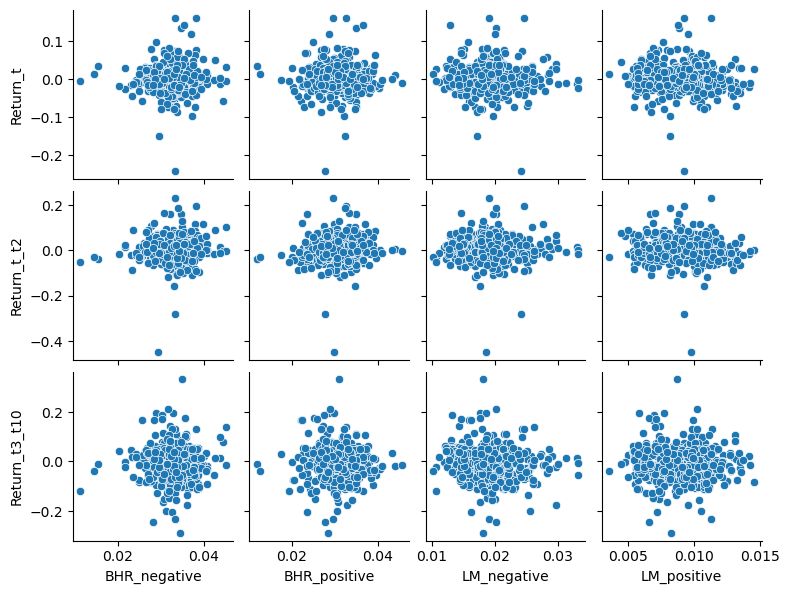
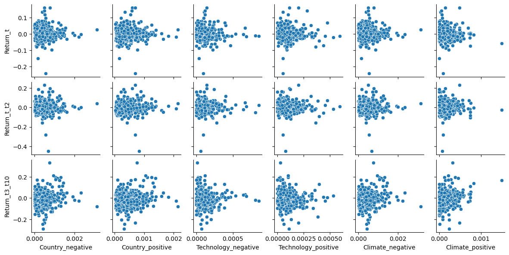

# Assignment 5 (Midterm) Report - Michael Parker

## Summary

A 10-K is a comprehensive report filed annually by public companies about their financial performance. This paper aims to conclude whether or not 10-Ks contains value-relevant information in the sentiment of the text. Furthermore, I try to predict whether or not the amount 'positive' and 'negative' words in each 10-K within companies in the S&P500 will give an indication as to what the stock price will do in the near future. There are also three topics (foreign countries, technology, and climate), with which these positive and negative sentiments are used with to also detect a change. My hypothesis was that when positive words are mentioned, the returns following the 10-K will go up, and when negative returns are mentioned, the returns following the 10-K will go down. In reality, the correlations between the two are much more lackluster than one would expect.

## Data

### Describing the Sample

The information comprised in this report is sourced from three distinct channels. Specifically, for the purpose of examining S&P 500 firms exclusively within the year 2022, the stock data utilized has been extracted from the latest available [2022 Wikipedia page](https://en.wikipedia.org/w/index.php?title=List_of_S%26P_500_companies&oldid=1130173030) listing S&P 500 companies. In order to prove the following line of reasons, it is important for me to give background information on what this large table of firms contains. Each company at it's core has an associated CIK, and this will serve the unit of observation to determine each company. Interestingly, the S&P500 is based on the top 500 CIK's, and not the top 500 tradable securities. This differentiation is crucial because some companies, like google, list more than one security, as seen here:


```python
import pandas as pd
pd.read_csv('inputs/sp500_2022.csv').query('CIK in [1652044]')
```


<div>
<style scoped>
    .dataframe tbody tr th:only-of-type {
        vertical-align: middle;
    }

    .dataframe tbody tr th {
        vertical-align: top;
    }

    .dataframe thead th {
        text-align: right;
    }
</style>
<table border="1" class="dataframe">
  <thead>
    <tr style="text-align: right;">
      <th></th>
      <th>Symbol</th>
      <th>Security</th>
      <th>SEC filings</th>
      <th>GICS Sector</th>
      <th>GICS Sub-Industry</th>
      <th>Headquarters Location</th>
      <th>Date first added</th>
      <th>CIK</th>
      <th>Founded</th>
    </tr>
  </thead>
  <tbody>
    <tr>
      <th>22</th>
      <td>GOOGL</td>
      <td>Alphabet Inc. (Class A)</td>
      <td>reports</td>
      <td>Communication Services</td>
      <td>Interactive Media &amp; Services</td>
      <td>Mountain View, California</td>
      <td>2014-04-03</td>
      <td>1652044</td>
      <td>1998</td>
    </tr>
    <tr>
      <th>23</th>
      <td>GOOG</td>
      <td>Alphabet Inc. (Class C)</td>
      <td>reports</td>
      <td>Communication Services</td>
      <td>Interactive Media &amp; Services</td>
      <td>Mountain View, California</td>
      <td>2006-04-03</td>
      <td>1652044</td>
      <td>1998</td>
    </tr>
  </tbody>
</table>
</div>


In reality, there are 503 securities/symbols in the S&P500; however, for this assignment, only unique CIK's were considered. This was done because the 10-K's were extracted using unique CIK numbers. Therefore, even if I have return data on the individual securities, it will show the same regression towards the returns because the sentiment would be pulled from an identical 10-K. The 10-K's were extracted from sec-edgar. Importantly, the sec-edgar-downloader used in this assignment only downloaded 498 10-K's and not 500. It was unable to get a 10-K for First Republic Bank or Signature Bank. Therefore, for the remainder of this assignment, **only 498 firms will be considered for analysis**. The return data was taken from a crsp 2022 stock return sample.

### Return Variables

The goal of this assignment was to analyze returns in three different ways: 1) on the day of the 10-K return (t), 2) the day of the 10-K and two additional days (t-t2), and the following 7 days after this (t3-t10). I thought of two different ways to accomplish this. The first way is to merge the crsp returns into the dataframe with the filing dataframe, locate the row where the date of the return is equal to the filing date using some sort of .loc and a mask, and then create two additional columns where the returns exist up to t-2 days and from t-3 to t-10 days. While this method worked for the returns on the day of the filing, I could not figure out a way to get versions 2 and 3 to work. The second way to accomplish this is to calculate the cumulative returns for **every single** day, and then when you do a merge at the end it will get rid of the ones you don't want anyway. This second method essentially makes it so you don't have to do a filter/mask at the beginning - as in, as long as you specify the merge right, it will do the 'mask' for you.

```python
crsp['Return_t_t2'] = crsp.groupby('CIK')['Return_t'].rolling(3).apply(lambda x: np.prod(1+x)-1).shift(-2).reset_index(0, drop=True)
crsp['Return_t_t2'] = crsp['Return_t_t2'].apply(lambda x: '{:.6f}'.format(x))
crsp['Return_t3_t10'] = crsp.groupby('CIK')['Return_t'].rolling(11).apply(lambda x: np.prod(1+x.iloc[3:])-1).shift(-10).reset_index(0, drop=True)
```

Here, I create all of the return variables in the original dataframe that I pulled the returns from, prior to doing any sort of merge. I create a column called `Return_t_t2`, and this code:
1. Groups by CIK number
2. Pulling data from only the return column
3. Uses a rolling window of 3 (for t, t1, t2)
4. Adds one to those three returns (for the purposes of cumprod)
5. Takes the cumulative return
6. Subtracts one
7. Shifts it back to do realign it with it's proper row index

`Return_t3_t10` was calculated the exact same way. The middle line of code was added because originally this column appeared in scientific notation and I wanted it to be formatted the same as the other ones.

### Sentiment Variables

This assignment contains a total of four sentiment dictionaries, or two sets of positive and negative dictionaries. One set is from Machine Learning (ML), and one set is from Loughran and McDonald (LM). These sets of dictionaries were essentially stored in the same exact way with slightly different intricaties:

```python
BHR_negative = (pd.read_csv('inputs/ML_negative_unigram.txt',header=None))[0].tolist()
BHR_negative_string = "(" + '|'.join(BHR_negative) + ")"

LM_negative = pd.read_csv('inputs/LM_MasterDictionary_1993-2021.csv').query('Negative != 0')['Word'].tolist()
LM_negative_string = "(" + '|'.join(LM_negative) + ")"
```

The reason for the slight difference in the first line for both negative dictionaries is because the BHR (ML) one contained _only_ the negative sentiments, while the LM csv file contains both, requiring an additional filter or `query`. The top lines each create a list. The bottom line creates a string that is in the proper format for near_regex to use.

- The BHR_negative dictionary has 94 words
- The BHR_positive dictionary has 75 words
- The LM_negative dictionary has 2355 words
- The LM_positive dictionary has 354 words

These differences are actually very important to recognize before performing any kind of analysis. Because the BHR dictionary has a much smaller amount of words compared to the LM dictionary, its sentiment score is naturally going to be smaller. Therefore, an exact comparison cannot be drawn between these two (that is, unless the correlation is found. At pure sentiment magnitude they cannot be compared). Additionally, there are also drastic differences between the amount of negative and positive words, primarily in the LM dictionaries. Subsequently, it would be hard to draw comparitive conclusions between these two. Therefore, when each is assigned a sentiment score, that number isn't incredibly accurate to use for comparisons. In order to get some sort of standardization, each sentiment 'count' was divided by the doc length to account for the ranging in lengths of 10-K's.

#### Near_regex

**partial=True**: I chose to set Partial=True, and this was primarily to just be on the safe side of things. In my opinion, there does not exist a case where if a word in one of the four sentiment dictionaries is pluralized or made past tense, it will no longer be a valid word for analysis. For this reason, I made Partial=True.

**max_words_between=10**: I chose this because in parsing through the 10-K's, I found multiple instances where negative/positive words were farther than 5 words apart from x variable, where in reality x variable _is_ related to the negative/positive word. A great example of this is in Accenture's 10-K: "2% negative impact from the disposition of our business in Russia." Here, it is clear that Russia caused a negative impact. However, there are 8 words in between 'negative' and 'Russia.' For this reason, I made max_words_between 10 to be safe.

### Contextual Sentiment

**Foreign countries**: I wanted to analyze how foreign countries impacted the stock price because I'm aware foreign relations can benefit companies (in terms of expanion opportunities), but also hinder companies (whether it be competition, or political based events, namely the Russia-Ukraine War). I grabbed the list of countries from a [wikipedia page](https://en.wikipedia.org/wiki/List_of_countries_and_dependencies_by_population).

**Technology**: Furthermore, I figured technology would be an good variable to measure because we are currently in a boom of artificial intelligence. Because we are performing this analysis on firms in 2022, it would be interesting to see which companies were 'ahead' of the AI boom and were already talking about AI in their 10-K's two years ago. This was around the time of the original Chat-GPT craze, so I assumed analyzing returns around this period of time would yield interesting results.

**Climate**: Lastly, I chose climate to be a contextual sentiment, mainly in terms of climate change and global warming. This can have a large impact in two regards: 1) physically affecting companies, in terms of plant/warehouse location, and 2) CSR (corporate social responsibility), in terms of representing themselves as an eco-friendly company to shareholders.

### Final Table

Let's take a look at what the final table looks like:


```python
sentiment_analysis = pd.read_csv('output/sentiment_analysis.csv')
sentiment_analysis.describe()
```


<div>
<style scoped>
    .dataframe tbody tr th:only-of-type {
        vertical-align: middle;
    }

    .dataframe tbody tr th {
        vertical-align: top;
    }

    .dataframe thead th {
        text-align: right;
    }
</style>
<table border="1" class="dataframe">
  <thead>
    <tr style="text-align: right;">
      <th></th>
      <th>CIK</th>
      <th>Doc_length</th>
      <th>Unique_words</th>
      <th>BHR_negative</th>
      <th>BHR_positive</th>
      <th>LM_negative</th>
      <th>LM_positive</th>
      <th>Country_negative</th>
      <th>Country_positive</th>
      <th>Technology_negative</th>
      <th>Technology_positive</th>
      <th>Climate_negative</th>
      <th>Climate_positive</th>
      <th>Return_t</th>
      <th>Return_t_t2</th>
      <th>Return_t3_t10</th>
    </tr>
  </thead>
  <tbody>
    <tr>
      <th>count</th>
      <td>4.980000e+02</td>
      <td>498.000000</td>
      <td>498.000000</td>
      <td>498.000000</td>
      <td>498.000000</td>
      <td>498.000000</td>
      <td>498.000000</td>
      <td>498.000000</td>
      <td>498.000000</td>
      <td>498.000000</td>
      <td>498.000000</td>
      <td>498.000000</td>
      <td>498.000000</td>
      <td>489.000000</td>
      <td>489.000000</td>
      <td>485.000000</td>
    </tr>
    <tr>
      <th>mean</th>
      <td>7.851046e+05</td>
      <td>70731.777108</td>
      <td>5482.761044</td>
      <td>0.032594</td>
      <td>0.030937</td>
      <td>0.019014</td>
      <td>0.009080</td>
      <td>0.000453</td>
      <td>0.000451</td>
      <td>0.000120</td>
      <td>0.000097</td>
      <td>0.000453</td>
      <td>0.000150</td>
      <td>0.000741</td>
      <td>0.003362</td>
      <td>-0.008294</td>
    </tr>
    <tr>
      <th>std</th>
      <td>5.501943e+05</td>
      <td>29366.745125</td>
      <td>1117.416479</td>
      <td>0.003968</td>
      <td>0.004206</td>
      <td>0.003772</td>
      <td>0.001943</td>
      <td>0.000380</td>
      <td>0.000331</td>
      <td>0.000106</td>
      <td>0.000082</td>
      <td>0.000380</td>
      <td>0.000160</td>
      <td>0.034288</td>
      <td>0.052249</td>
      <td>0.064712</td>
    </tr>
    <tr>
      <th>min</th>
      <td>1.800000e+03</td>
      <td>9786.000000</td>
      <td>1521.000000</td>
      <td>0.011190</td>
      <td>0.011751</td>
      <td>0.010144</td>
      <td>0.003572</td>
      <td>0.000000</td>
      <td>0.000029</td>
      <td>0.000000</td>
      <td>0.000000</td>
      <td>0.000000</td>
      <td>0.000000</td>
      <td>-0.242779</td>
      <td>-0.447499</td>
      <td>-0.288483</td>
    </tr>
    <tr>
      <th>25%</th>
      <td>9.727650e+04</td>
      <td>52074.500000</td>
      <td>4805.000000</td>
      <td>0.030421</td>
      <td>0.028225</td>
      <td>0.016460</td>
      <td>0.007659</td>
      <td>0.000185</td>
      <td>0.000200</td>
      <td>0.000053</td>
      <td>0.000043</td>
      <td>0.000185</td>
      <td>0.000045</td>
      <td>-0.016493</td>
      <td>-0.025470</td>
      <td>-0.048074</td>
    </tr>
    <tr>
      <th>50%</th>
      <td>8.825095e+05</td>
      <td>65953.000000</td>
      <td>5352.000000</td>
      <td>0.032721</td>
      <td>0.031202</td>
      <td>0.018742</td>
      <td>0.009220</td>
      <td>0.000383</td>
      <td>0.000407</td>
      <td>0.000098</td>
      <td>0.000078</td>
      <td>0.000383</td>
      <td>0.000104</td>
      <td>-0.001638</td>
      <td>0.000101</td>
      <td>-0.009661</td>
    </tr>
    <tr>
      <th>75%</th>
      <td>1.136007e+06</td>
      <td>80898.500000</td>
      <td>5919.000000</td>
      <td>0.034837</td>
      <td>0.033736</td>
      <td>0.021033</td>
      <td>0.010291</td>
      <td>0.000602</td>
      <td>0.000582</td>
      <td>0.000158</td>
      <td>0.000122</td>
      <td>0.000602</td>
      <td>0.000206</td>
      <td>0.015826</td>
      <td>0.028495</td>
      <td>0.029294</td>
    </tr>
    <tr>
      <th>max</th>
      <td>1.868275e+06</td>
      <td>271719.000000</td>
      <td>10468.000000</td>
      <td>0.045116</td>
      <td>0.045687</td>
      <td>0.033208</td>
      <td>0.014570</td>
      <td>0.003138</td>
      <td>0.002150</td>
      <td>0.000856</td>
      <td>0.000593</td>
      <td>0.003138</td>
      <td>0.001497</td>
      <td>0.162141</td>
      <td>0.229167</td>
      <td>0.332299</td>
    </tr>
  </tbody>
</table>
</div>


```python
print("1:", len(sentiment_analysis),"\n")
print("2:",sentiment_analysis['_merge'].value_counts(),"\n")
columns = ['BHR_negative', 'BHR_positive', 'LM_negative', 'LM_positive', 'Country_negative', 'Country_positive', 'Technology_negative', 'Technology_positive', 'Climate_negative', 'Climate_positive']
unique_count = []
for column in columns:
    unique_count.append(sentiment_analysis[f'{column}'].value_counts().count())
print("3:",unique_count)
```

    1: 498 
    
    2: _merge
    both         489
    left_only      9
    Name: count, dtype: int64 
    
    3: [498, 498, 498, 498, 495, 498, 482, 488, 495, 452]
    

1. As specified before, this code only has 498 unique CIK values, so this is still the length of the dataframe.
2. It appears that the crsp dataframe did not have returns for 9 of the firms in the S&P 500.
3. This demonstrates that the sentiment and contextual analyses seem to be valid. All 4 raw sentiment scores are unique, and most of the contextual sentiment scores are unique

Based on these observations, nothing appears to be "fishy," and this table should be appropriate to analyze for some final results.

## Results

### Correlation Table


```python
sentiments = ['BHR_negative', 'BHR_positive', 'LM_negative', 'LM_positive', 'Country_negative', 'Country_positive', 'Technology_negative', 'Technology_positive', 'Climate_negative', 'Climate_positive']
returns = ['Return_t', 'Return_t_t2', 'Return_t3_t10']
columns = sentiments + returns
sentiment_analysis_correlation = sentiment_analysis[columns].corr()[returns].drop(returns, axis=0)
sentiment_analysis_correlation
```


<div>
<style scoped>
    .dataframe tbody tr th:only-of-type {
        vertical-align: middle;
    }

    .dataframe tbody tr th {
        vertical-align: top;
    }

    .dataframe thead th {
        text-align: right;
    }
</style>
<table border="1" class="dataframe">
  <thead>
    <tr style="text-align: right;">
      <th></th>
      <th>Return_t</th>
      <th>Return_t_t2</th>
      <th>Return_t3_t10</th>
    </tr>
  </thead>
  <tbody>
    <tr>
      <th>BHR_negative</th>
      <td>0.033666</td>
      <td>0.089990</td>
      <td>0.019764</td>
    </tr>
    <tr>
      <th>BHR_positive</th>
      <td>0.002436</td>
      <td>0.053678</td>
      <td>-0.044396</td>
    </tr>
    <tr>
      <th>LM_negative</th>
      <td>-0.029568</td>
      <td>-0.008178</td>
      <td>-0.113914</td>
    </tr>
    <tr>
      <th>LM_positive</th>
      <td>-0.059041</td>
      <td>-0.074237</td>
      <td>-0.042622</td>
    </tr>
    <tr>
      <th>Country_negative</th>
      <td>0.031333</td>
      <td>0.018834</td>
      <td>0.109872</td>
    </tr>
    <tr>
      <th>Country_positive</th>
      <td>0.000733</td>
      <td>-0.009848</td>
      <td>0.099235</td>
    </tr>
    <tr>
      <th>Technology_negative</th>
      <td>-0.049280</td>
      <td>-0.007030</td>
      <td>-0.014084</td>
    </tr>
    <tr>
      <th>Technology_positive</th>
      <td>-0.018909</td>
      <td>-0.013580</td>
      <td>-0.057484</td>
    </tr>
    <tr>
      <th>Climate_negative</th>
      <td>0.031333</td>
      <td>0.018834</td>
      <td>0.109872</td>
    </tr>
    <tr>
      <th>Climate_positive</th>
      <td>-0.041240</td>
      <td>0.027755</td>
      <td>0.242563</td>
    </tr>
  </tbody>
</table>
</div>


### Scatterplots

#### Sentiment Dictionaries


```python
import seaborn as sns
sns.pairplot(data=sentiment_analysis, x_vars=sentiments[0:4], y_vars=returns, height=2)
```


    <seaborn.axisgrid.PairGrid at 0x23554cbbd90>


    

    


#### Contextual Sentiment Dictionaries


```python
graph = sns.pairplot(data=sentiment_analysis, x_vars=sentiments[4:10], y_vars=returns, height=2)
```


    

    


### Discussion Topics


```python
sentiment_analysis_correlation['Return_t'][0:4].to_frame()
```


<div>
<style scoped>
    .dataframe tbody tr th:only-of-type {
        vertical-align: middle;
    }

    .dataframe tbody tr th {
        vertical-align: top;
    }

    .dataframe thead th {
        text-align: right;
    }
</style>
<table border="1" class="dataframe">
  <thead>
    <tr style="text-align: right;">
      <th></th>
      <th>Return_t</th>
    </tr>
  </thead>
  <tbody>
    <tr>
      <th>BHR_negative</th>
      <td>0.033666</td>
    </tr>
    <tr>
      <th>BHR_positive</th>
      <td>0.002436</td>
    </tr>
    <tr>
      <th>LM_negative</th>
      <td>-0.029568</td>
    </tr>
    <tr>
      <th>LM_positive</th>
      <td>-0.059041</td>
    </tr>
  </tbody>
</table>
</div>


1. It was hypothesized that when positive words are mentioned, the returns following the 10-K will go up, and when negative returns are mentioned, the returns following the 10-K will go down. In this small sample, the BHR_negative correlation was 0.033666 and the LM_negative correlation was -0.029568. Both of these correlations are very close to 0, indicating that there is no real correlation between the negative sentiments and returns on the day of the filing. Even though the LM_negative has a correlation that _is_ negative, it is still so close to 0 this is likely negligible. There is a similar story with both positive sentiments, having correlations so close to 0 that it can be concluded that there is no real correlation.

2. The patterns in the Garcia, Hu, and Rohrer paper are somewhat similar to the results seen in this report. The paper has a LM positive of -0.14, where I have -0.06; The paper has a LM negative of -0.06 where I have -0.03; The paper has a ML positive of 0.05 where I have 0.00; and the paper has a ML negative of -0.05 where I have 0.03. The trends of the LM dictionaries are very similar. We both show that it is inaccurate, in the sense that the positive dictionary has a more negative correlation than the negative dictionary. However, the ML dictionaries are contrasting. There are a multitude of reasons for why we might have varying data. The first, and much less likely reason, is bias within their paper. Their abstract makes it clear that their objective is to prove that the ML dataset is more accurate than the LM one; therefore, this could lead to explicit or implicit bias when adding their additional controls (i.e. they were 'trying' to make the ML one more accurate). However, I do not believe this is the case. I'm guessing these additional controls they put in, coupled with the more firms and years they added, did indeed add to the accuracy to the ML correlations and predictions. Candidly, there could also be a small error that I am not seeing in my code that is leading to my poor BHR correlations.


```python
sentiment_analysis_correlation[returns][4:10]
```


<div>
<style scoped>
    .dataframe tbody tr th:only-of-type {
        vertical-align: middle;
    }

    .dataframe tbody tr th {
        vertical-align: top;
    }

    .dataframe thead th {
        text-align: right;
    }
</style>
<table border="1" class="dataframe">
  <thead>
    <tr style="text-align: right;">
      <th></th>
      <th>Return_t</th>
      <th>Return_t_t2</th>
      <th>Return_t3_t10</th>
    </tr>
  </thead>
  <tbody>
    <tr>
      <th>Country_negative</th>
      <td>0.031333</td>
      <td>0.018834</td>
      <td>0.109872</td>
    </tr>
    <tr>
      <th>Country_positive</th>
      <td>0.000733</td>
      <td>-0.009848</td>
      <td>0.099235</td>
    </tr>
    <tr>
      <th>Technology_negative</th>
      <td>-0.049280</td>
      <td>-0.007030</td>
      <td>-0.014084</td>
    </tr>
    <tr>
      <th>Technology_positive</th>
      <td>-0.018909</td>
      <td>-0.013580</td>
      <td>-0.057484</td>
    </tr>
    <tr>
      <th>Climate_negative</th>
      <td>0.031333</td>
      <td>0.018834</td>
      <td>0.109872</td>
    </tr>
    <tr>
      <th>Climate_positive</th>
      <td>-0.041240</td>
      <td>0.027755</td>
      <td>0.242563</td>
    </tr>
  </tbody>
</table>
</div>


3. Above is the correlations for all of my contextual sentiment measures and their respective return on the day of the 10-K filing. It is a similar story to the BHR and LM dictionaries, in that there is no strong correlation. However, there is one interesting thing I notice. Although this section is meant to be purely dedicated to the return on the day of the filing (day t), if we show the returns for t-t2 and t3-t10, **all** technology values are negative, regardless of positive/negative sentiment. Yes, while the magnutide is rather small of all of these, it might say something that whenever technology is mentioned, the sign is negative. Nonetheless, when just analyzing the return on the day of the filing, the correlations are too small to draw conclusions from.


```python
sentiment_analysis_correlation[returns][0:2]
```


<div>
<style scoped>
    .dataframe tbody tr th:only-of-type {
        vertical-align: middle;
    }

    .dataframe tbody tr th {
        vertical-align: top;
    }

    .dataframe thead th {
        text-align: right;
    }
</style>
<table border="1" class="dataframe">
  <thead>
    <tr style="text-align: right;">
      <th></th>
      <th>Return_t</th>
      <th>Return_t_t2</th>
      <th>Return_t3_t10</th>
    </tr>
  </thead>
  <tbody>
    <tr>
      <th>BHR_negative</th>
      <td>0.033666</td>
      <td>0.089990</td>
      <td>0.019764</td>
    </tr>
    <tr>
      <th>BHR_positive</th>
      <td>0.002436</td>
      <td>0.053678</td>
      <td>-0.044396</td>
    </tr>
  </tbody>
</table>
</div>


4. This data above is nothing but sporadic. Let's first look at BHR_negative. On the day of the filing, there is a very small positive correlation to returns; on the two days following the filing, there is a slightly higher positive correlation to returns; and on the week following, there is the smallest correlation so far. The BHR_positive follows a similar trend - the correlation goes up and then back down. What this _could_ indicate is that the sentiment from a 10-K **does have an impact in the short term** (as in the first three days) but after the 'hype' dies down, the stock prices reflects back to normal. Yet, it cannot be stressed enough that these correlations are smalllllllll.
